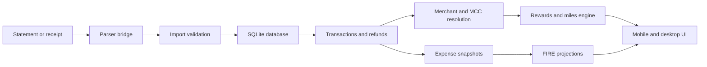

# Goal of this project

To consolidate my Agentic AI learning:

1. Multi-agent AI SDLC with orchestration, PRD drafting, roadmap feedback by technical members, development and testing suite;
2. Epic/task level breakdown for development and testing context management, and traceability;
3. Mandatory evals for proper requirement mapping ("Evals are the new PRD"), golden evals, and segregating binary vs LLM-as-a-judge eval cases.

- [docs/IMPLEMENTATION_HANDOFF.md](docs/IMPLEMENTATION_HANDOFF.md): architecture, product behavior,
  schema, UI requirements, and implementation sequence.
- [docs/IMPLEMENTATION_TEAM_REVIEW.md](docs/IMPLEMENTATION_TEAM_REVIEW.md): review notes and open
  decisions from architecture, delivery, design, and QA perspectives.
- [docs/evals.json](docs/evals.json): acceptance evals for deterministic behavior and LLM-judged
  merchant/MCC classification.

# FIRE Planner

A local-first FIRE planner for Singapore personal finance, statement ingestion, card miles
tracking, refund handling, and redemption planning.

The project combines three jobs that usually live in separate tools:

- FIRE planning: expense snapshots, net worth assumptions, FI date projections, and scenarios.
- Transaction intelligence: bank or card statement parsing, duplicate detection, categorization,
  refunds, merchant resolution, MCC tagging, and review workflows.
- Miles optimization: card-rule evaluation, pending and reversed miles, redeemable chunks, and
  spend-to-next-redemption milestones.

The design goal is simple: make the planner react to actual spending data instead of stale manual
inputs. Spreadsheets can still sit at the grown-up table; they just should not run the whole meeting.

## Architecture

The V1 target is a responsive React/Vite app backed by local persistence and domain modules that can
later be packaged for desktop or mobile.



Core layers:

- `src/db`: SQLite schema, migrations, repositories, export/import, and local persistence.
- `src/ingestion`: parser contract, import preview, duplicate detection, and commit workflow.
- `src/transactions`: categorization, refund matching, net spend, and review models.
- `src/merchant`: MCC taxonomy, merchant heuristics, and correction learning loop.
- `src/rewards`: card rules, formula evaluation, reward ledger, and redeemable projection.
- `src/planner`: expense snapshot connector, projection engine, and scenario comparison.
- `src/ui`: app shell, responsive surfaces, and design tokens.

Key architectural rules:

- SQLite is the local source of truth.
- The app stores parser output, file hashes, warnings, and audit metadata by default, not original
  statement PDFs.
- Parser output flows into TypeScript-owned validation and persistence so there is one database
  writer.
- Transactions are canonical records. Corrections update user-owned metadata and trigger
  recalculation.
- Reward ledger entries are append-only. Refunds and corrections create reversal or adjustment
  entries.
- Expense snapshots are versioned and feed the FIRE projection engine.
- Card-rule sources must track source URL, source type, verification date, and effective date.

For the detailed implementation handoff, see
[docs/IMPLEMENTATION_HANDOFF.md](docs/IMPLEMENTATION_HANDOFF.md).

### Evals As Product Spec

The eval suite in [docs/evals.json](docs/evals.json) is treated as a living PRD.

Traditional PRDs describe intent. Evals turn that intent into executable acceptance checks:

- Binary evals verify deterministic behavior such as schema shape, parser contracts, duplicate
  handling, refund treatment, reward ledger arithmetic, accessibility, and responsive UI behavior.
- LLM-as-judge evals cover merchant, shop, category, and MCC classification where exact labels can
  be ambiguous without bank-acquirer data.
- Each eval links back to requirements, priority, grader type, fixture inputs, expected outcomes,
  and pass criteria.
- Roadmap evals can be written before implementation, then promoted into CI gates as features land.

This makes the eval file the practical contract between product, implementation, and QA. If a feature
matters, it should eventually have an eval. If an eval fails, the product is telling the truth in a
slightly rude font.

The intended harness model:

- `implemented` evals fail CI when they regress.
- `roadmap` evals report pending coverage without blocking work.
- LLM judge evals use deterministic fixtures by default and live model scoring only when explicitly
  enabled.

## Unique Selling Points

- Persistent local database: Spending, imports, corrections, card rules, reward ledger entries, and
  planner snapshots persist locally instead of disappearing after a session.
- Statement and receipt intelligence: The parser workflow normalizes transaction data and keeps audit
  metadata, parser warnings, duplicate checks, and review states.
- Refund-aware planning: Refunds net off spending categories and create miles reversals instead of
  inflating FIRE expenses or rewards.
- Redemption milestone tracking: The miles engine distinguishes accumulated, pending, reversed, and
  redeemable miles, then calculates spend needed for the next transferable chunk.
- Singapore credit-card focus: Card rules, MCC treatment, exclusions, caps, and source verification
  are designed for Singapore miles optimization rather than generic budgeting.
- Review inbox workflow: Uncertain imports, MCC guesses, unmatched refunds, stale card rules, and
  miles exceptions are routed into a correction flow.
- Planner integration: Accepted expense snapshots feed FIRE projections, so real spending can update
  FI assumptions without rewriting history.
- Local-first privacy posture: The default architecture avoids cloud sync and avoids storing original
  statements unless encrypted storage and deletion controls are added later.

## Roadmap

Near term:

- Complete the mobile home, Cards/Miles tab, desktop dashboard, and review inbox against the eval
  suite.
- Add an executable eval harness for `docs/evals.json`.
- Expand parser fixtures across statement formats, refunds, duplicate imports, and low-confidence
  rows.
- Add more verified Singapore card rules, MCC seeds, and redemption-program rules.

Planned integrations:

- Telegram receipt upload: Send receipts to a Telegram bot, ingest the file or image, hash it, parse
  it, and route extracted transactions into the same review workflow as statement imports.
- Telegram query interface: Ask for summaries such as monthly spend, pending review items,
  redeemable miles, or card recommendations from Telegram.
- Hermes or local agent integration: Expose a read-only, permissioned query layer so a local agent can
  answer questions using planner, transaction, reward, and merchant data with source lineage.
- OpenClaw or similar local-agent support: Let local automation query approved data domains without
  direct database access.

Longer term:

- Desktop packaging with Tauri or Electron once database, parser, and UI contracts stabilize.
- Native mobile or mobile wrapper only after the parser strategy is settled.
- Optional encrypted source-file attachment with deletion controls.
- Optional cloud sync using local SQLite as the source of truth and encrypted sync payloads.
- Personal-OS direction: Treat FIRE Planner as one private data domain that can contribute financial
  context to a broader local agent system, with explicit permissions and audit trails. Ambition is
  useful. So are locks.

## Fork And Run

Prerequisites:

- Node.js compatible with the version used by this project.
- npm.
- Playwright browsers for e2e tests.
- Python parser dependencies when the parser bridge is wired to a real parser.

Install:

```sh
npm install
```

Run the app locally:

```sh
npm run dev
```

Build:

```sh
npm run build
```

Run database migrations:

```sh
npm run db:migrate
```

Run checks:

```sh
npm run typecheck
npm run lint
npm run test
npm run test:e2e
```

Format:

```sh
npm run format
```

Preview the production build:

```sh
npm run preview
```
